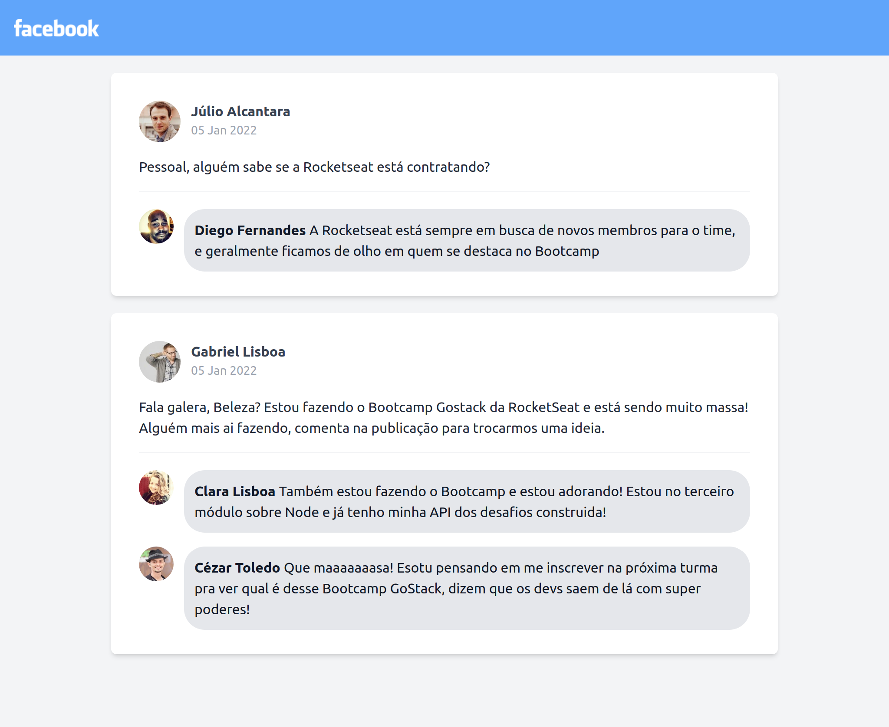

# Interface Facebook

Este projeto é criado utilizando **ReactJS** e **Tailwind**.

Nessa aplicação implementei uma **interface** semelhante a do
**Facebook** com comportamento **responsivo**.

As informações contidas na interface são **estáticas**

## Resultado abaixo Mobile/Desktop

  
    

